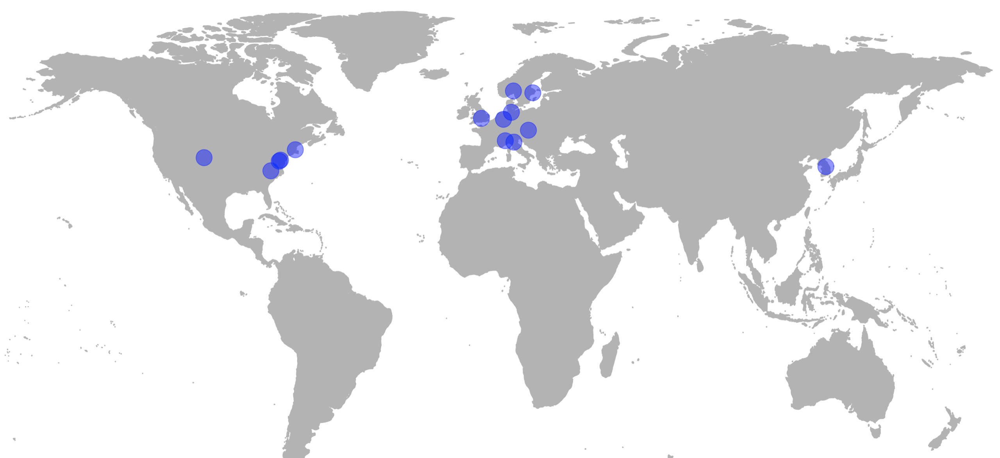

# Placebo Imaging Consortium

## *An international consortium to foster the understanding of the placebo-effect with neuroimaing.*
#### *Since 2015*

*This website is under construction*

### Consortium Leaders
[Ulrike Bingel](https://www.uk-essen.de/clinical_neurosciences_bingel), [Tor Wager](https://pbs.dartmouth.edu/people/tor-wager), [Matthias Zunhammer](https://www.uk-essen.de/clinical_neurosciences_bingel/), [Tamas Spisak](https://pni-lab.github.io)

### Consortium Members
*Lauren Atlas, PhD, National Center for Complementary and Integrative Health, National Institutes of Health, Bethesda, Maryland, and National Institute on Drug Abuse, National Institutes of Health, Baltimore, Maryland*

*Fabrizio Benedetti, MD, University of Turin, Turin, Italy and Plateau Rosà Labs, Plateau Rosà, Switzerland*

*Christian Büchel, MD, University Medical Center Hamburg–Eppendorf, Hamburg, Germany*

*Jae Chan Choi, MD, PhD, Yonsei University, Wonju, South Korea*

*Luana Colloca, MD, PhD, University of Maryland, Baltimore, Maryland*

*Davide Duzzi, PhD, University of Modena e Reggio Emilia, Modena, Italy*

*Falk Eippert, PhD, Max Planck Institute for Human Cognitive and Brain Sciences, Leipzig, Germany*

*Dan-Mikael Ellingsen, PhD, Harvard Medical School, Cambridge, Massachusetts*

*Sigrid Elsenbruch, PhD, Essen University Hospital, Essen, Germany*

*Stephan Geuter, PhD, Johns Hopkins University, Baltimore, Maryland*

*Ted J. Kaptchuk, Beth Israel Deaconess Medical, Harvard Medical School, Boston, Massachusetts*

*Simon S. Kessner, MD, University Medical Center Hamburg–Eppendorf, Hamburg, Germany*

*Irving Kirsch, PhD, Harvard Medical School, Cambridge, Massachusetts*

*Jian Kong, MD, Massachusetts General Hospital, Harvard Medical School, Cambridge, Massachusetts*

*Claus Lamm, PhD, University of Vienna, Vienna, Austria*

*Siri Leknes, PhD, University of Oslo, Oslo, Norway*

*Helena Hartmann, PhD, University Hospital Essen, Essen, Germany*

*Alexa Müllner-Huber, PhD, PhD, University of Vienna, Vienna, Austria*

*Fausta Lui, MD, University of Modena e Reggio Emilia, Modena, Italy*

*Carlo A. Porro, MD, PhD, University of Modena e Reggio Emilia, Modena, Italy*

*Markus Rütgen, PhD, University of Vienna, Vienna, Austria*

*Lieven A. Schenk, PhD, University Medical Center Hamburg-Eppendorf, Hamburg, Germany*

*Julia Schmid, PhD, Essen University Hospital, Essen, Germany*

*Nina Theysohn, MD, Essen University Hospital, Essen, Germany*

*Irene Tracey, PhD, University of Oxford, Oxford, United Kingdom*

*Nathalie Wrobel, PhD, Karolinska Institute, Solna, Sweden*

*Fadel Zeidan, PhD, Wake Forest School of Medicine, Winston-Salem, North Carolina*

## Publications
Zunhammer M, Bingel U, Wager TD, Placebo Imaging Consortium. **Placebo effects on the neurologic pain signature: a meta-analysis of individual participant functional magnetic resonance imaging data.** JAMA neurology. 2018 Nov 1;75(11):1321-30. [doi: 10.1001/jamaneurol.2018.2017](https://doi.org/10.1001/jamaneurol.2018.2017)

Zunhammer M, Bingel U, Wager TD, Placebo Imaging Consortium. **Laterality and Stimulation Bias in Meta-analysis of Placebo Responses—Reply.** JAMA neurology. 2019 May 20. [doi: 10.1001/jamaneurol.2019.1232](https://doi.org/10.1001/jamaneurol.2019.1232)

Zunhammer M, Spisák T, Wager TD, Bingel U., Placebo Imaging Consortium.  **Meta-analysis of neural systems underlying placebo analgesia from individual participant fMRI data.** Nature communications. 2021 Mar 2;12(1):1-1. [doi: 10.1038/s41467-021-21179-3](https://doi.org/10.1038/s41467-021-21179-3)
